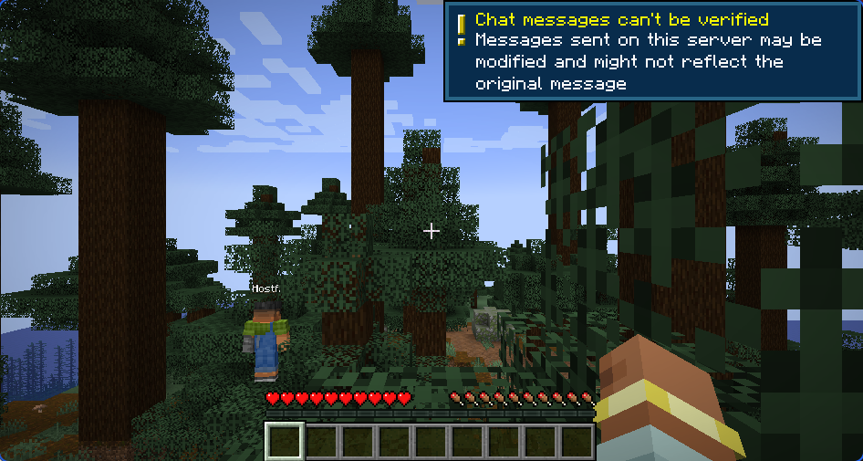
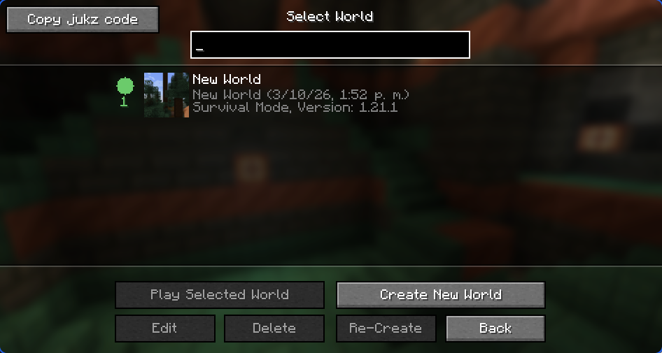
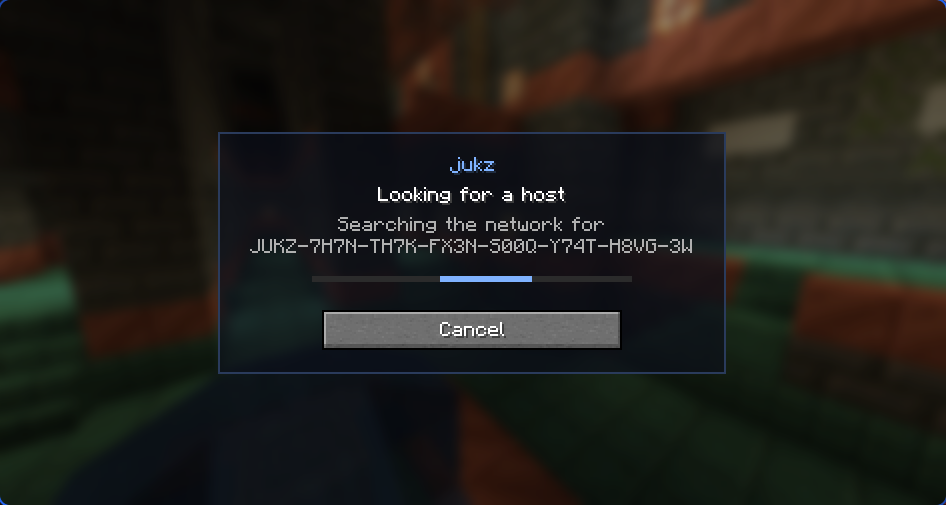
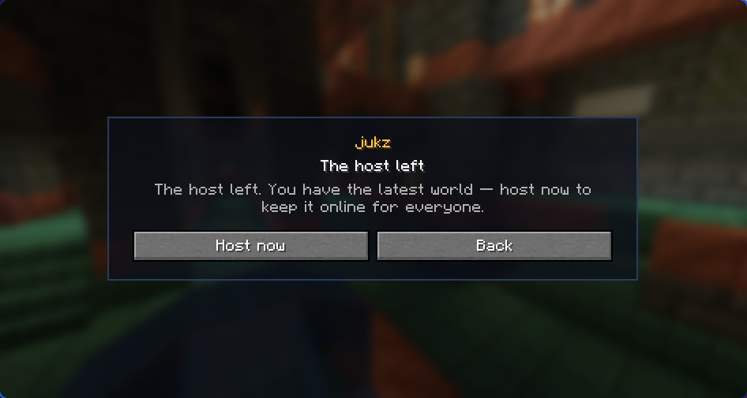
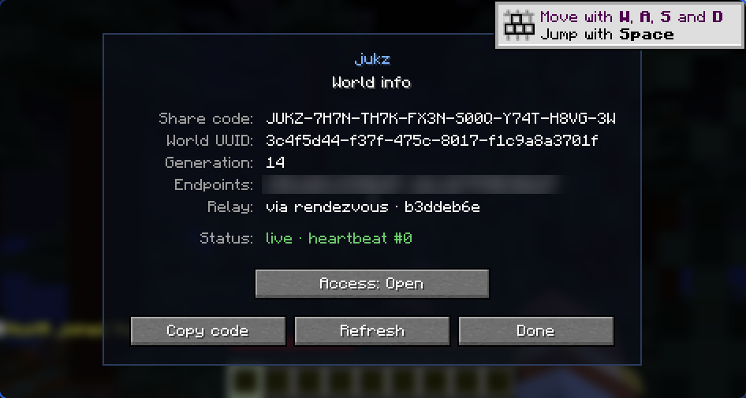
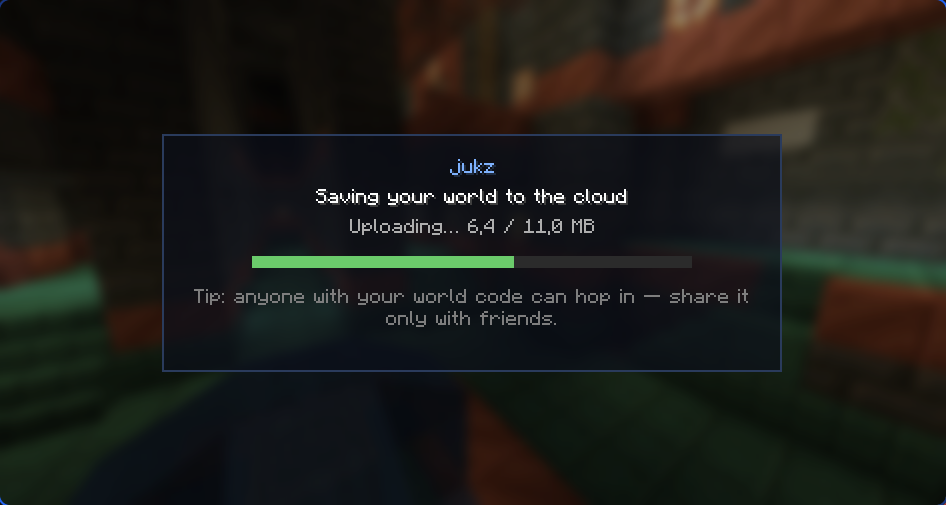
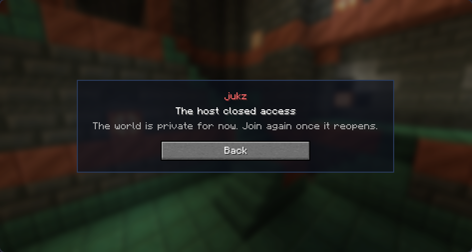

# jukz

A Minecraft **Fabric 1.21.1** mod (Java 21) that gives every world a permanent UUID and uses a
**rendezvous server + LAN multicast** to discover who is currently hosting it.
Opening a world asks the network "is anyone hosting this right now?": if yes, you join that live
host as a **guest**; if no, the world opens locally and is **announced** as the active host. On
close, the announcement is withdrawn. The world effectively lives in one place at a time — on
whoever's host is "switched on" — with rotating ownership and no manual coordination. There is no
save synchronization: a guest plays live on the host's world (like Open-to-LAN), not on a copy.

Verified in-game end-to-end with two clients against the production rendezvous (`jukz.nuulm.com`),
with the WebSocket relay forced: auto-host on open, auto-join, joining by code, the live-connection
handoff, the cloud (ghost) takeover, closing/reopening access and the world-list live badge.

## Playing

Install, next to Minecraft **1.21.1** with Fabric Loader ≥ 0.16.5:
[Fabric API](https://modrinth.com/mod/fabric-api),
[Fabric Language Kotlin](https://modrinth.com/mod/fabric-language-kotlin),
[owo-lib](https://modrinth.com/mod/owo-lib) and the jukz jar (`fabric/build/libs/jukz-0.1.0.jar`).

- **Host:** just open a world. It is announced automatically; the share code is in the pause menu →
  **World info (jukz)**, which also has **Access: Open/Closed** to make the world private for a while.
- **Join:** Multiplayer → **Play together** → paste the code. A friend's world you already have a copy
  of shows a green dot in the world list while someone hosts it; opening it joins them.
- **Leaving:** quitting with guests online hands the world to one of them (**Host now**); quitting
  alone backs it up to the cloud, and whoever opens it next continues from there.

Settings live in `config/jukz.properties`: `rendezvous.url` (empty = the public server, `none` =
LAN-only, or your own), `rendezvous.auth-token`, `jukz.offline-guests` (see below) and
`jukz.force-relay` (testing).

### Who can do what

- **The share code** finds a world and lets you *ask* to join. The game login is vanilla's: when the
  host has a Microsoft account, guests are verified by Mojang exactly like on a normal server (the relay
  only moves bytes). A host without one (offline launchers) — or one that sets
  `jukz.offline-guests=true` for a group that trusts each other — hosts in offline mode, where names
  can't be verified; jukz then refuses the host's name and names already in the world, so nobody gets
  kicked out of their own character.
- **The world key** (`jukz.key` in the save, Ed25519) is what changes the world online: announcing it,
  heartbeats, withdrawing, and uploading or downloading its cloud backup are signed with it, and the
  rendezvous binds the key on first use. It travels with the world files (handoff, cloud backup), and
  the host gives it — with the handoff gate — over the game connection to each player it lets in, who
  keep it in `config/jukz-keys/`. So a player who has been in a world can host it and revive it from the
  cloud; someone with only the code can't take over the live record, overwrite the backup, download it,
  or grab a handoff.
- A copy that holds a different key than the one bound online (e.g. two copies of a world made before
  keys existed) still plays locally and on the LAN; World info says why it isn't online. Taking the world
  over from its host (handoff or cloud) brings the right key.
- LAN multicast discovery is unsigned: the local network is trusted.

## Screenshots

Two dev clients on one machine, against the production rendezvous with the relay forced.

| | |
|---|---|
|  |  |
| A guest playing live in the host's world, joined through the relay | The world list: the green dot means someone is hosting it right now |
|  |  |
| Opening a world first asks the network who is hosting it | The host left with a guest connected: the guest has the latest world and can take over |
|  |  |
| World info: share code, generation, relay and a live self-check (endpoints blurred) | Closing with nobody around backs the world up to R2 for the next player |
|  | |
| The host closed access: no takeover is offered, so the world can't split | |

See [`docs/superpowers/specs/2026-06-08-jukz-design.md`](docs/superpowers/specs/2026-06-08-jukz-design.md)
for the full design rationale (verified against primary sources) and
[`docs/superpowers/plans/2026-06-08-jukz-core.md`](docs/superpowers/plans/2026-06-08-jukz-core.md)
for the implementation plan.

## Module layout

| Module | What | Minecraft? |
|---|---|---|
| `core` | The deterministic protocol heart — pure Kotlin, fully unit-tested | No |
| `fabric` | Wires `core` into Minecraft 1.21.1 via Fabric API + network adapters | Yes |
| `rendezvous-worker` | The production discovery backend at `jukz.nuulm.com` (Cloudflare Worker + Durable Objects + R2) — see [`rendezvous-worker/README.md`](rendezvous-worker/README.md) | No |
| `rendezvous` | Self-hostable discovery backend with the same `/v1` contract (Rust + Axum, outside Gradle) — see [`rendezvous/README.md`](rendezvous/README.md) | No |

Keeping `core` Minecraft-free means the hard logic (host election, fencing, handshake, registry,
relay) is tested on plain Kotlin + JUnit5 without the heavy Loom/Minecraft toolchain.

## What is real and tested

- **`core` (94 tests):**
  - `WorldId` with a copyable Base32 share code; `NodeId`; `Endpoint`; `ClaimToken` (the fencing
    token: `generation → millis → nodeId`); `WorldKey` (Ed25519 ownership key and request signing).
  - `WorldRegistry` + `InMemoryWorldRegistry` — CAS-on-token publish, TTL expiry, heartbeat refresh.
    `WorldRecordCodec` — compact binary wire encoding of a record (v4: endpoint candidate list +
    optional relay offer; still decodes v1; < 1000 bytes).
  - `HostElection` — split-brain tie-break, ghost detection + fenced takeover (`generation+1`),
    stale-token rejection (rules R1–R14 from the spec). `HeartbeatLivenessProbe` for R10/R11.
  - `handshake` — sealed `Message` set (incl. `HostLeaving` with a snapshot offer and `HostClosed`),
    byte-exact binary `MessageCodec`, host/joiner state machines, and `FramedMessageChannel`.
  - `transport` — `LocalTcpRelay`, `DirectTcpTransport`, `SocketChannel`, `ConnectionType`
    (CONTROL / DATA / SNAPSHOT discriminator byte), and the `ChannelDialer` ladder (direct endpoints
    first, then the relay).
  - `join` — `JoinController`: the guest flow (lookup → control-channel handshake → relay → game
    hand-off), plus a live reader on the control channel that reports a handoff (`HostLeaving`), a
    closed world (`HostClosed`) or an abrupt drop.
  - `host` — `HostController` + `HostConnectionServer`: open → serve → publish under a fencing
    `ClaimToken` → heartbeat → withdraw, routing CONTROL / DATA / SNAPSHOT channels on the one port the
    game uses. End-to-end loopback tests run a real host against a real guest (discovery → handshake →
    byte relay → handoff / close). `ForwardingEndpointResolver` + `PortForwarder` keep router
    port-opening best-effort: it never fails the host.
- **`fabric` (42 tests, plus the in-game runs above):**
  - World identity: `WorldIdState` (1.21.1 `PersistentState`) + `WorldIdSidecar` (pre-start
    `jukz.dat`), and `WorldSaveLocator` to find a world's save by UUID.
  - **Auto-host on open** — `HostCoordinator` (on `ClientPlayConnectionEvents.JOIN`) bumps the fence
    and runs `HostController` with `MinecraftLanOpener` (`IntegratedServer.openToLan`, then
    offline-mode so relayed guests aren't kicked by Mojang auth — jukz authorizes via the world code).
  - **Auto-join on open** — `IntegratedServerLoaderMixin` + `WorldOpenInterceptor` consult discovery
    before booting a world; a live host turns the open into a join. If the cloud holds a strictly newer
    copy than the local one, it is pulled first.
  - **Discovery** — `CompositeWorldRegistry` layers `RendezvousWorldRegistry` (the JSON `/v1`
    contract; 90 s leases, heartbeat at TTL/3, observed public IP appended server-side) over
    `LanMulticastWorldRegistry` (same-network play with no internet; falls back to in-memory if
    multicast is blocked). A rejected announce is never silent: `SupersededScreen` lets the player keep
    the local copy or join the live host. The per-install `NodeId` lives in `config/jukz.nodeid`.
  - **NAT traversal** — `UpnpPortForwarder` (dependency-free SSDP + SOAP `UpnpMapper`) opens the router
    port when it can. When it can't (no UPnP / CGNAT, or `jukz.force-relay`), `WsRelayClient` registers
    a WebSocket relay session on the rendezvous and the record advertises it; guests fall back to it via
    `WsRelayTransport`. Validated live, locally and against production.
  - **World handoff (F4)** — a host closing with guests forces a save, snapshots the world with JGit
    (excluding `session.lock`), arms the pack under a one-shot gate token and pushes `HostLeaving` over
    the control channel that is already open. The guest pulls the pack over a SNAPSHOT channel on the
    same path it plays on (direct or relay), resets to it, and **Host now** re-opens it locally under a
    bumped generation that fences past the old host. Taking over reopens access if that copy was closed.
  - **Ghost takeover (R2)** — a host closing alone uploads the pack to the rendezvous' R2 store
    (`R2SnapshotStore`, `UploadingWorldScreen` with progress, retries and an escape valve); a guest that
    finds no live host but a newer cloud copy is offered to take over from it. If a live handoff reaches
    nobody, or the guest declines, the world is backed up to the cloud instead of stranded.
  - **Ownership & admission** — `WorldKeyStore` (save key + keys received as a guest), signed
    rendezvous calls, `WorldAccessPayload` (key + handoff gate, sent in-game on join),
    `GuestAdmission` + `PlayerManagerJoinMixin` (online mode for real accounts; offline-mode name
    refusals). Validated in-game: an impostor with the code is refused and gets neither the key nor the
    handoff, and can't revive the world from the cloud, while a real guest takes over and later revives it.
  - **Access control** — World info's **Access: Open/Closed** writes `jukz.access=disabled` to the
    world's `jukz.properties`, sends guests `HostClosed`, then withdraws and kicks them. Guests see
    `AccessClosedScreen` with no takeover offered, so a stale copy can't go live beside the private one.
  - **World list** — `WorldEntryMixin` + `WorldListLiveBadge` draw a green "live · N" dot on hosted
    saves (10 s per-world lookup cache, clicking it joins), and a **Copy jukz code** button.
  - **UI** — every screen is an owo-ui model on one shared theme (see *Editing screens* below).
- **`rendezvous-worker`** — 18 tests (the rules ported from the Rust unit tests, URL signing, and the
  ownership checks, including a signature made by the JDK); validated in production. **`rendezvous`**
  (Rust) — 20 `cargo test`s; it does not check world keys (see its README).

## What is flagged (`// requires live-network testing`)

- `IceTransport` / `HolePuncher` throw `NotImplementedError`, with the live API calls documented in
  KDoc: symmetric-NAT UDP hole punch / QUIC tunnel. The WebSocket relay already covers hosts without
  UPnP, so these would only cut relay traffic.
- `StunEndpointResolver` (UPnP external IP, STUN fallback) is implemented but not wired: the rendezvous
  observes the public IP itself. It remains the primitive for a serverless path.
- Real routers: the UPnP round-trip and the relay have only crossed loopback/one machine so far — a
  test from two different networks (one behind CGNAT) is still to do.

## Build & test

```bash
./gradlew :core:test     # the deterministic core tests (94)
./gradlew :fabric:test   # the fabric JUnit tests (snapshot handoff, access flag, UI models, ...)
./gradlew build          # compile everything + assemble fabric/build/libs/jukz-0.1.0.jar
(cd rendezvous-worker && npm install && npm test)   # the Cloudflare rendezvous
(cd rendezvous && cargo test)                       # the self-hostable Rust rendezvous
```

Requires **JDK 21** (`JAVA_HOME`; Gradle 8.10.1 does not run on newer JDKs). The wrapper pins Gradle
8.10.1 and Fabric Loom 1.7.

### Editing screens (owo-ui, hot reload)

Every jukz screen is an [owo-ui](https://docs.wispforest.io/owo/ui/) XML model in
`fabric/src/main/resources/assets/jukz/owo_ui/`; the Kotlin class (a `JukzUiScreen`) only fills in
data and wires components by `id`.

| Model | Screens |
|---|---|
| `theme.xml` | Shared look — panel frame, brand, title/message/hint text, buttons, progress bar, info rows. Change it once, every screen follows. |
| `status.xml` | All status screens (`JukzStatusScreen`): searching, connecting, the host left, handing off, couldn't connect, nobody hosting, already live elsewhere, access closed |
| `host_info.xml` | World info (pause menu) |
| `join_prompt.xml` | Play together (multiplayer screen) |
| `upload.xml` | Saving your world to the cloud |

In a dev run (`gradlew runClientA` / `runClientB`) the models are read straight from `src/` and an
open screen rebuilds itself when its model **or `theme.xml`** is saved — edit, save, look, no restart.
A malformed model falls back to the packaged copy and owo reports the parse error. Kotlin changes still
need a restart. `UiModelsTest` checks in plain JUnit that the models parse, use existing theme
templates and declare the ids their screens look up. Players need
[owo-lib](https://modrinth.com/mod/owo-lib) installed, like Fabric API; the bundled owo-sentinel tells
them if it is missing.

### Testing host ↔ guest on one machine

Two isolated dev clients (separate `runDir`, so separate logs / saves / config / `jukz.nodeid` —
distinct peers) are wired as Loom run configs:

```bash
./gradlew runClientA   # instance A (username HostA),  run dir fabric/run/clientA  (Windows: run-client-a.bat)
./gradlew runClientB   # instance B (username GuestB), run dir fabric/run/clientB  (Windows: run-client-b.bat)
```

Open a world in A (it auto-hosts; the share code is under pause menu → **World info (jukz)**), then
in B either open a copy of the same world (auto-join) or use **Play together** on the multiplayer
screen with A's code. Both use the public rendezvous unless `rendezvous.url` in
`fabric/run/client{A,B}/config/jukz.properties` says otherwise. Two instances on one machine find each
other directly, so set `jukz.force-relay=true` in both to exercise the relay path. To test server
changes, run the Worker locally (`npx wrangler dev --port 18791 --local` in `rendezvous-worker`, see
its README) and point `rendezvous.url` at `http://127.0.0.1:18791`.

To verify the **handoff**: A opens a world, B joins, A does **Save and Quit**, then B clicks **Host
now** on the prompt — B pulls A's snapshot and takes over (the A↔B generation keeps climbing). The log
lines `handing off — notifying N guest(s)` (host) and `taking over … (snapshot applied)` (guest)
confirm each step.

## Follow-ups

- **Two real networks:** play once across two homes (one behind CGNAT) to confirm UPnP and the relay
  outside one machine.
- **Relay cost:** relayed play is billed as Durable Object WebSocket messages; batching small frames
  in `WsRelayClient`/`WsRelayTransport` would cut that if it ever matters. World packs over the plan's
  request limit (100 MB on Free) can't be backed up through the Worker.
- **Cleanup:** taking over a never-seen world leaves a `jukz-<code>` save folder; consider naming.
- **Polish:** World info briefly shows "not announced" right after a world opens, until the first
  announce lands (it re-polls on its own).

## Support

jukz is free, and its public rendezvous (discovery, relay and cloud backups on Cloudflare) is paid for
out of pocket. If it saved your world, you can chip in on **[Ko-fi](https://ko-fi.com/nobmz)** — it
keeps the servers on for everyone. Donations unlock nothing: every feature stays free.

## License

MIT.
