

# jukz

### Your Minecraft world, wherever you are. Your friends, whenever they want.

Open a world and your friends can jump in, **no server, no port forwarding, no "is the host online?"** 
When the host leaves, someone else takes over. When everyone leaves, the world waits for you in the cloud.

  
  
  
  

  
  
  
  

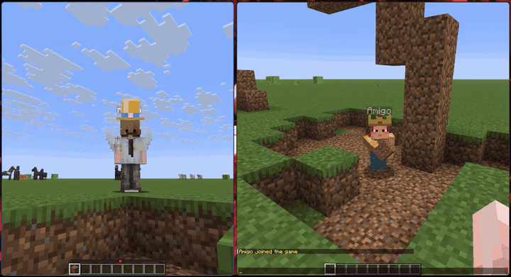

---

## What it does

### 🌍 Play together without hosting anything
Open a world and jukz does the rest. Friends paste your **share code** (Multiplayer → *Play together*), or
just open their own copy of the world and join you automatically. It works through routers and mobile
data, because jukz brings its own relay.

<table>
<tr>
<td width="50%">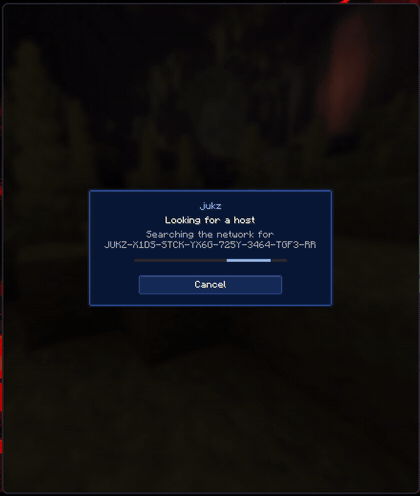</td>
<td width="50%"></td>
</tr>
<tr>
<td>Paste a friend's code: jukz finds who is hosting and drops you into their world.</td>
<td>Opening a world first checks if anyone is already in it. If so, you join instead of splitting the world.</td>
</tr>
</table>

### 🔁 The world never goes offline just because the host left
Quit with friends still in? One click on **Host now** and they carry on with the exact world you had.
Quit alone? The world is backed up to the cloud, and whoever opens it next continues from there.

<table>
<tr>
<td width="50%">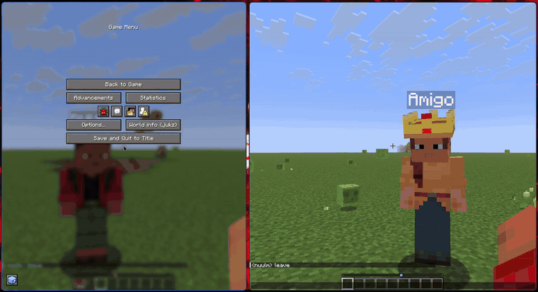</td>
<td width="50%">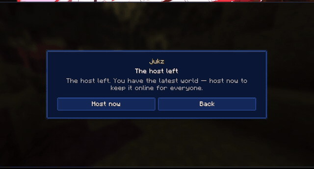</td>
</tr>
<tr>
<td>The host left with you inside: one click on <b>Host now</b> and you keep playing.</td>
<td>Nobody around? Your world is saved to the cloud for next time.</td>
</tr>
</table>

### 💻 Your worlds on every PC
Sign in with a Microsoft account and your cloud worlds follow you: start the game on another PC, a new
launcher instance or a friend's computer, and they come over.

### 🧭 One hub for everything
Your profile, cosmetics, skin and cloud worlds live in one window, the jukz hub (the person or cube icon
on the title screen, the cube in the pause menu, or Mod Menu → Config). A side menu picks the section,
you stand on the right in 3D on every one of them, and it fills your screen. On a small window or a big
GUI scale it switches to a compact layout: icons in the menu, names in tooltips.

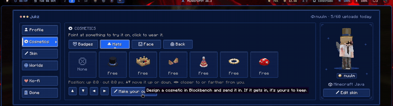

### 🎩 Cosmetics, free
Hats, glasses, a mustache, backpacks, wings, and a pixel badge next to your name in the tab list.
Everyone running jukz sees what you wear. Nothing here is a resource pack.

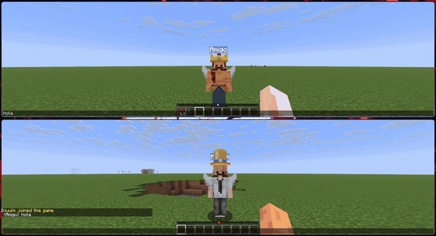

<table>
<tr>
<td width="50%">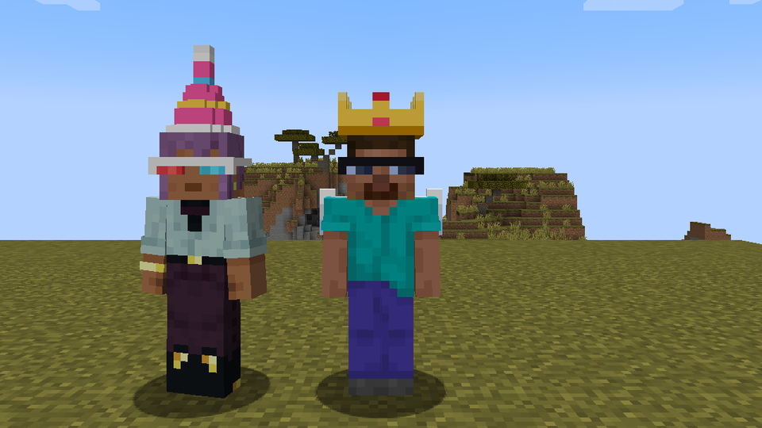</td>
<td width="50%">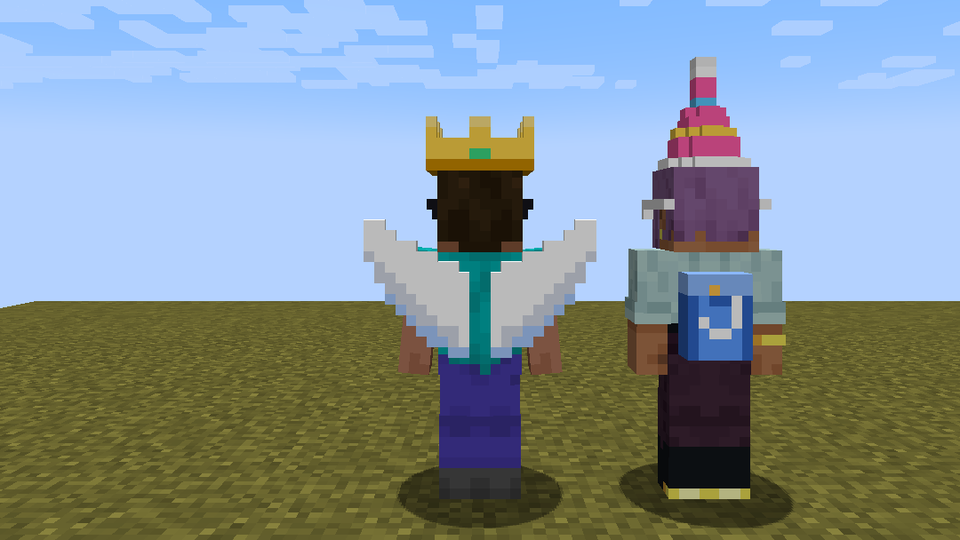</td>
</tr>
<tr>
<td>A crown, sunglasses, a party hat, 3D glasses…</td>
<td>…and wings or the jukz backpack.</td>
</tr>
<tr>
<td>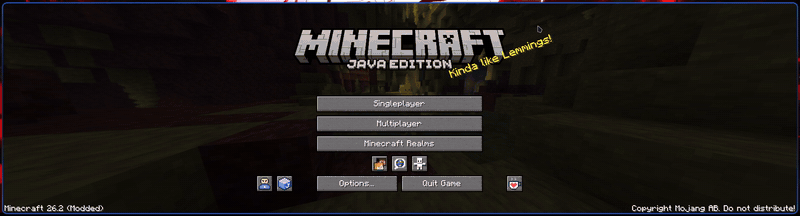</td>
<td>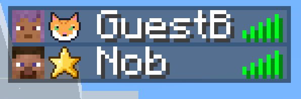</td>
</tr>
<tr>
<td>Point at a card to try it on, click to wear it (drag yourself to turn).</td>
<td>Everyone's badge shows in the tab list.</td>
</tr>
</table>

**Want to make one?** Design it in [Blockbench](https://www.blockbench.net/) and send it at
[nuulm.com/jukz/crear](https://nuulm.com/jukz/crear). If it gets in, it's free for everyone with your name
on it, and it stays yours if the shop ever starts charging.

### 🧑‍🎨 Your skin, even without a Mojang account
Hub → **Skin**: choose a PNG (or drop one on the window), pick classic or slim arms, and see it on
yourself before applying.

- **Mojang account:** jukz changes your real skin, the same way minecraft.net does. Your session token goes
  to Mojang only. You see it at once; friends see it when their game reloads your profile.
- **No Mojang account:** the skin stays on your PC. When you play through jukz, your game hands it to the
  host over the game connection and the host passes it to everyone in the world. No jukz server stores
  it, and it's gone from the host's memory when the world closes. Friends with jukz see it in the world
  and in the tab list.

<table>
<tr>
<td width="50%">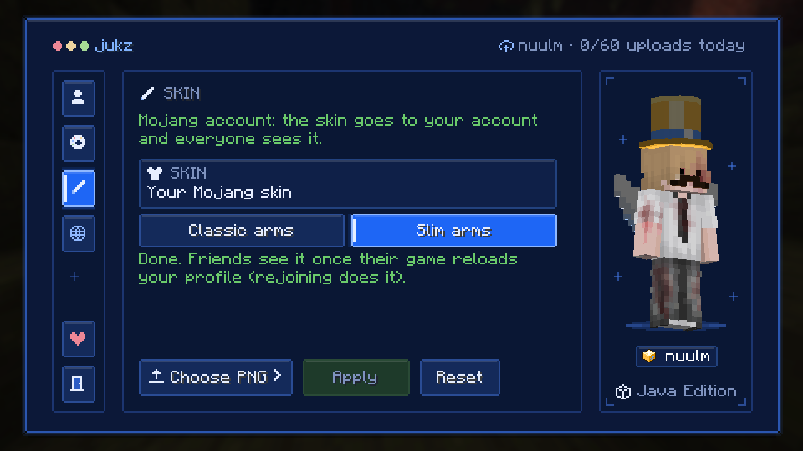</td>
<td width="50%">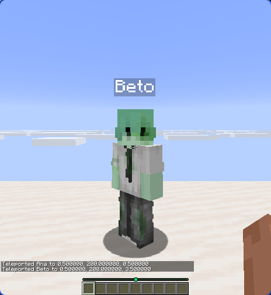</td>
</tr>
<tr>
<td>Choose, preview, apply.</td>
<td>Two offline players: Ana sees the skin Beto picked, sent from his PC to hers.</td>
</tr>
</table>

### 🔒 You decide who gets in
Close access from the pause menu and the world turns private. Guests are checked by Mojang like on a normal
server, and every world has an owner key, so someone with only the code can't take it over.

<table>
<tr>
<td width="50%"></td>
<td width="50%"></td>
</tr>
<tr>
<td>Pause menu → <b>World info (jukz)</b>: your share code, and Access: Open / Closed.</td>
<td>When you close access, nobody can join or take over.</td>
</tr>
</table>

---

## Install in a minute

1. Minecraft **1.21.1** with [Fabric Loader](https://fabricmc.net/use/) 0.16.5 or newer.
2. Put these in your `mods` folder:
   [Fabric API](https://modrinth.com/mod/fabric-api) ·
   [Fabric Language Kotlin](https://modrinth.com/mod/fabric-language-kotlin) ·
   [owo-lib](https://modrinth.com/mod/owo-lib) ·
   the **jukz jar** from the [latest release](https://github.com/Nuulz/jukz/releases/latest).
3. Open a world. That's it, jukz announces it automatically.

Every friend needs the mod too. After an update, jukz shows you what changed, once.

## Free, with or without an account

| | No account | Microsoft account |
|---|---|---|
| Playing with friends, handoff, relay | ✅ | ✅ |
| Cloud backup size | up to 40 MB | up to 95 MB |
| Kept in the cloud | 30 days | 180 days |
| Backups per day | 10 | 60 |
| Your worlds on every PC | No | up to 50 |
| Cosmetics | No | ✅ free |

Limits only apply to the **cloud copy**. Your worlds on your PC never expire, and a world over the limit still
plays and hands off normally. A fresh world is about 4.6 MB, so 40 MB covers well-played worlds.

## Tested across real networks

One player at home, one on phone data behind CGNAT: joining by code, handing the world over both ways,
auto-join from the world list and cloud backups all worked through jukz's relay.

<table>
<tr>
<td width="50%">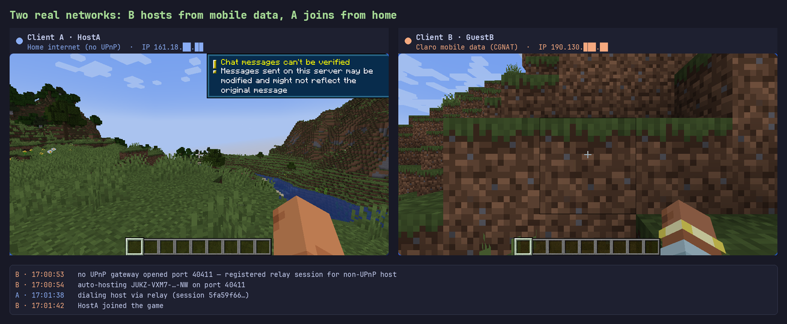</td>
<td width="50%">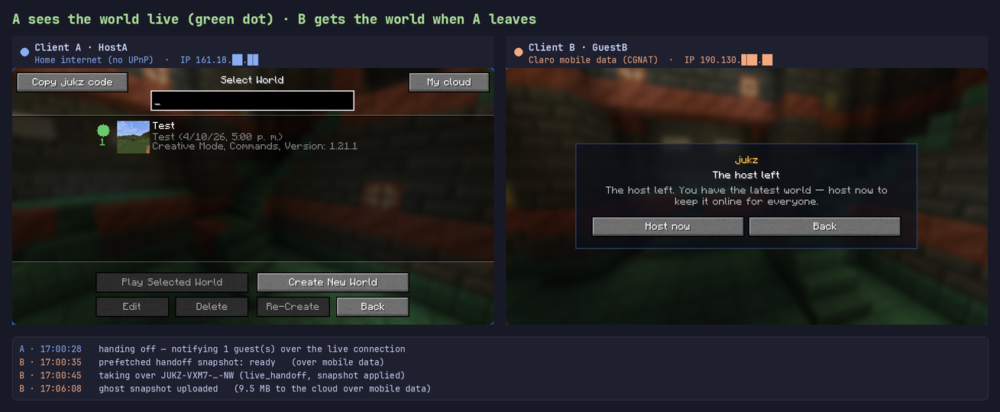</td>
</tr>
</table>

## Support jukz

jukz is free, and the servers (discovery, relay and cloud backups) are paid for out of pocket. If it saved
your world, you can chip in on **[Ko-fi](https://ko-fi.com/nobmz)**. Donations unlock nothing: every feature
stays free.

<table>
<tr>
<td width="50%">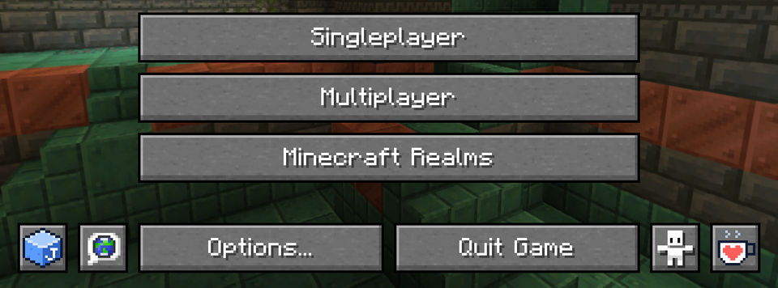</td>
<td width="50%">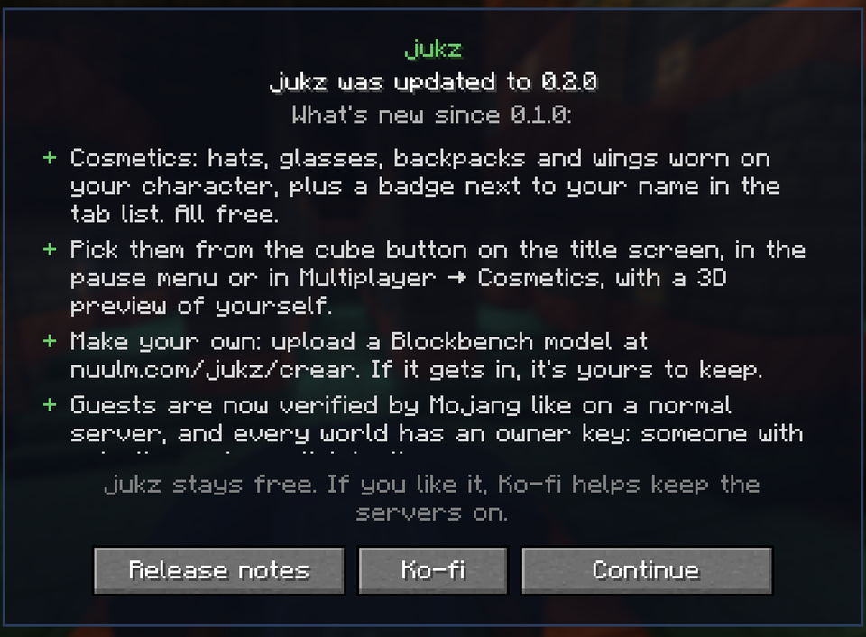</td>
</tr>
</table>

---

**Building, hosting your own server or contributing?** Everything technical, architecture, tests, the
self-hostable rendezvous, releasing, is in [`docs/DEVELOPERS.md`](docs/DEVELOPERS.md).
Changes by version: [`CHANGELOG.md`](CHANGELOG.md).

Released under the [MIT license](LICENSE).
